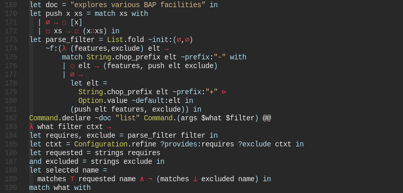

# functional-conceal
[Neo]Vim concealments for functional languages.

Activated by `<Local Leader>c`

Just add this repository as a plugin, e.g. with [Plug](https://github.com/junegunn/vim-plug):
```vim
Plug 'XVilka/functional-conceal'
```
See the example on how it looks in my setup:


Any suggestions or contributions are welcome!
